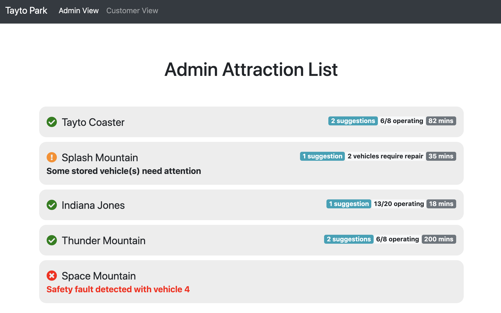
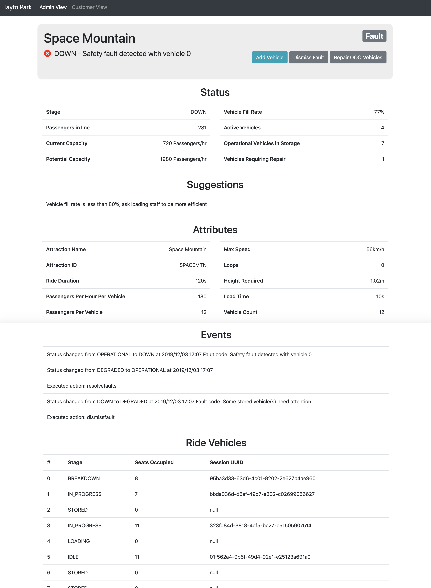

# Park Manager Web Interface
The Park Manager Service hosts a web interface with views for park administrators to get detailed stats, breakdown history, and perform actions on attractions. Park guests also have a simplified view that shows the available attractions with the current wait time and some static facts such as the height required to ride and the number of loops on the ride. This page automatically updates every second as it polls the Park Manager service directly.

### Admin List
The admin list view can be accessed at `http://localhost:8080/adminlist.html`. Here is an example of this interface:

This list gives administrators an at a glance view of the current status of every ride. The current stage is shown (operational, down, or degraded) along with any fault messages. Wait times, number of operating vehicles/vehicles requiring repair, and number of suggestions is shown for every ride.

### Admin Attraction View
The admin attraction view can be accessed by clicking a ride on the admin attraction list page. Here is an example of this page:

This page shows very detailed information about the ride. Starting from the top, it shows the current status, fault code (if any) and has a set of action buttons. The actions are as follows:
- Add Vehicle: Move a vehicle from storage to the track. This increases the current capacity.
- Dismiss Fault: Move the faulty vehicle off the track and resume the ride. This will set the attraction status to DEGRADED .
- Repair OOO (out of order) Vehicles: This repairs any OUT_OF_ORDER vehicles and moves them to storage. The ride status is also set back to OPERATIONAL.

The status section shows the live status of many ride characteristics. Some key ones are current capacity (calculated by # active vehicles * passengers per hr per vehicle) and potential capacity (calculated by adding active and stored vehicles and multiplying by passengers per hr per vehicle).

The attributes section shows the static ride facts (configured in the attraction's `config.yml`).

Events is a record of the status changes of the attraction as well as any commands sent via the Park Manager to the attraction.

The Ride Vehicles section shows a detailed list of each ride vehicle along with the stage of the vehicle, the number of passengers, and a UUID associated with the vehicle's current group of passengers.